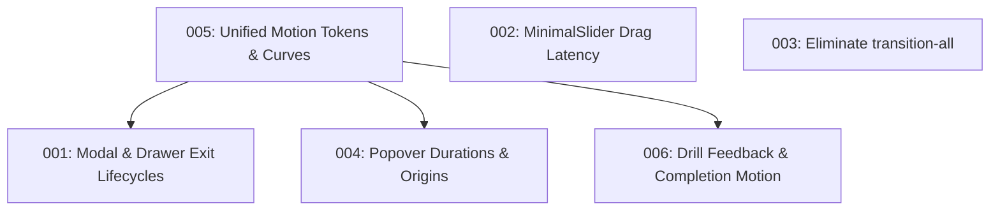

# Animation Improvement Roadmap

Generated by `/improve-animations` senior motion audit.
Evaluated against Emil Kowalski's design engineering motion criteria across 8 categories:
1. Purpose & Frequency
2. Easing & Duration
3. Physicality & Origin
4. Interruptibility
5. Performance
6. Accessibility
7. Cohesion & Tokens
8. Missed Opportunities

## Plans Catalog

| # | Plan | Severity | Category | Status | Est. Scope |
|---|------|----------|----------|--------|------------|
| [001](001-modal-exit-lifecycles.md) | [Fix Modal and Drawer Exit Animations Across Application](001-modal-exit-lifecycles.md) | **HIGH** | Interruptibility & Lifecycle | DONE | 8 files, ~120 lines |
| [002](002-slider-drag-latency.md) | [Eliminate Pointer Latency on MinimalSlider Dragging](002-slider-drag-latency.md) | **HIGH** | Purpose & Frequency | DONE | 1 file, ~20 lines |
| [003](003-eliminate-transition-all.md) | [Eliminate `transition-all` on Core Containers and Cards](003-eliminate-transition-all.md) | **HIGH** | Performance | DONE | 5 files, ~25 lines |
| [004](004-popover-durations-and-origins.md) | [Tune Popover Durations, Filter Blurs, and Transform Origins](004-popover-durations-and-origins.md) | **MEDIUM** | Easing, Duration & Origin | DONE | 4 files, ~35 lines |
| [005](005-unified-motion-tokens.md) | [Establish Unified Motion Tokens, Purge `ease-in`, and Refine Reduced Motion](005-unified-motion-tokens.md) | **MEDIUM** | Cohesion, Easing & A11y | DONE | 3 files, ~45 lines |
| [006](006-drill-feedback-and-completion-motion.md) | [Polish Typing Drill Feedback and Completion Modal Motion](006-drill-feedback-and-completion-motion.md) | **HIGH** | Missed Opportunities & Physicality | DONE | 3 files, ~40 lines |

## Recommended Execution Order & Dependencies



1. **Step 1: Plan 005** (`005-unified-motion-tokens.md`)
   *Foundation*: Defines shared CSS tokens in `src/index.css` and shared Motion curves in `src/lib/motion.ts`. Purges `ease-in` on body. Subsequent plans reference these tokens.
2. **Step 2: Plan 001** (`001-modal-exit-lifecycles.md`)
   *High leverage feel fix*: Eliminates the universal bug where modals, drawers, and confirmation dialogues snap shut instantaneously with 0 exit animation.
3. **Step 3: Plan 002** (`002-slider-drag-latency.md`)
   *Immediate direct manipulation fix*: Fixes pointer lag when dragging terminal/code sliders.
4. **Step 4: Plan 003** (`003-eliminate-transition-all.md`)
   *Performance*: Strips untargeted `transition-all` from terminal shell, split-panes, and cards.
5. **Step 5: Plan 004** (`004-popover-durations-and-origins.md`)
   *Responsiveness*: Cuts sluggish 500ms popovers down to 180–220ms and anchors origins to triggers.
6. **Step 6: Plan 006** (`006-drill-feedback-and-completion-motion.md`)
   *Delight & Tactile Feedback*: Replaces broken `animate-fadeIn` on drill completion celebration and syntax lock alert with hardware-accelerated Motion transitions.

## Execution Instructions

To execute any plan with any agent or model, pass the plan file directly:
```bash
# E.g. Execute Plan 001
improve-animations execute plans/001-modal-exit-lifecycles.md
```
Or instruct an agent:
> "Execute the plan in `plans/001-modal-exit-lifecycles.md`. Follow all steps and verification checks verbatim."
